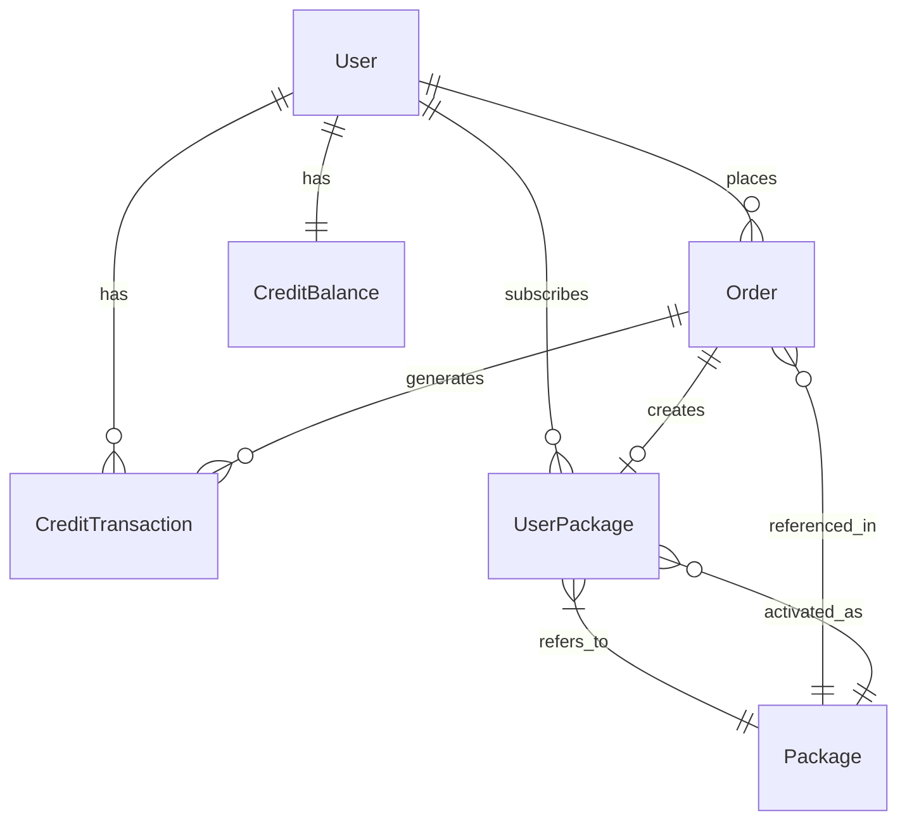

# 数据库设计文档

## 1. 数据库概述

### 1.1 数据库选择
- **数据库类型**：MySQL 8.0
- **ORM框架**：Prisma
- **连接池**：Prisma内置连接池
- **字符集**：utf8mb4

### 1.2 命名规范
- 表名：小写，下划线分隔（snake_case）
- 字段名：小写，下划线分隔（snake_case）
- 索引名：idx_表名_字段名
- 外键名：fk_表名_关联表名

## 2. 数据表设计

### 2.1 套餐表 (packages)

| 字段名 | 类型 | 必填 | 默认值 | 说明 |
|--------|------|------|--------|------|
| id | CHAR(36) | 是 | UUID | 主键 |
| name | VARCHAR(100) | 是 | - | 套餐名称 |
| name_en | VARCHAR(100) | 否 | - | 英文名称 |
| version | VARCHAR(20) | 是 | - | 版本号 |
| description | TEXT | 否 | - | 套餐描述 |
| price | INT | 是 | - | 价格(分) |
| original_price | INT | 否 | - | 原价(分) |
| currency | VARCHAR(10) | 是 | CNY | 货币类型 |
| daily_credits | INT | 是 | - | 每日积分数 |
| valid_days | INT | 是 | 30 | 有效天数 |
| features | JSON | 否 | - | 套餐特性 |
| limitations | JSON | 否 | - | 使用限制 |
| sort_order | INT | 是 | 0 | 排序 |
| is_active | BOOLEAN | 是 | true | 是否启用 |
| is_recommended | BOOLEAN | 是 | false | 是否推荐 |
| tag | VARCHAR(50) | 否 | - | 标签(HOT/NEW等) |
| created_at | DATETIME | 是 | NOW | 创建时间 |
| updated_at | DATETIME | 是 | NOW | 更新时间 |

**索引**：
- PRIMARY KEY (id)
- INDEX idx_packages_sort_order (sort_order)
- INDEX idx_packages_is_active (is_active)
- INDEX idx_packages_version (version)

### 2.2 用户套餐表 (user_packages)

| 字段名 | 类型 | 必填 | 默认值 | 说明 |
|--------|------|------|--------|------|
| id | CHAR(36) | 是 | UUID | 主键 |
| user_uuid | VARCHAR(255) | 是 | - | 用户ID |
| package_id | CHAR(36) | 是 | - | 套餐ID |
| order_no | VARCHAR(255) | 是 | - | 关联订单号 |
| start_date | DATETIME | 是 | - | 开始日期 |
| end_date | DATETIME | 是 | - | 结束日期 |
| daily_credits | INT | 是 | - | 每日积分(快照) |
| package_snapshot | JSON | 否 | - | 套餐快照 |
| is_active | BOOLEAN | 是 | true | 是否激活 |
| is_auto_renew | BOOLEAN | 是 | false | 自动续费 |
| created_at | DATETIME | 是 | NOW | 创建时间 |
| updated_at | DATETIME | 是 | NOW | 更新时间 |

**索引**：
- PRIMARY KEY (id)
- INDEX idx_user_packages_user_uuid (user_uuid)
- INDEX idx_user_packages_package_id (package_id)
- INDEX idx_user_packages_order_no (order_no)
- INDEX idx_user_packages_end_date (end_date)
- INDEX idx_user_packages_is_active (is_active)

### 2.3 积分余额表 (credit_balances)

| 字段名 | 类型 | 必填 | 默认值 | 说明 |
|--------|------|------|--------|------|
| id | CHAR(36) | 是 | UUID | 主键 |
| user_uuid | VARCHAR(255) | 是 | - | 用户ID |
| package_credits | INT | 是 | 0 | 套餐积分 |
| package_reset_at | DATETIME | 否 | - | 套餐积分重置时间 |
| independent_credits | INT | 是 | 0 | 独立积分 |
| total_used | INT | 是 | 0 | 总使用量 |
| total_purchased | INT | 是 | 0 | 总购买量 |
| version | INT | 是 | 0 | 版本号(乐观锁) |
| created_at | DATETIME | 是 | NOW | 创建时间 |
| updated_at | DATETIME | 是 | NOW | 更新时间 |

**索引**：
- PRIMARY KEY (id)
- UNIQUE KEY uk_credit_balances_user_uuid (user_uuid)
- INDEX idx_credit_balances_updated_at (updated_at)

### 2.4 积分流水表 (credit_transactions)

| 字段名 | 类型 | 必填 | 默认值 | 说明 |
|--------|------|------|--------|------|
| id | CHAR(36) | 是 | UUID | 主键 |
| trans_no | VARCHAR(255) | 是 | - | 交易号 |
| user_uuid | VARCHAR(255) | 是 | - | 用户ID |
| type | ENUM | 是 | - | 类型(income/expense/reset) |
| credit_type | ENUM | 是 | - | 积分类型(package/independent) |
| amount | INT | 是 | - | 变动数量 |
| before_balance | INT | 是 | - | 变动前余额 |
| after_balance | INT | 是 | - | 变动后余额 |
| order_no | VARCHAR(255) | 否 | - | 关联订单号 |
| description | VARCHAR(500) | 否 | - | 描述 |
| metadata | JSON | 否 | - | 元数据 |
| created_at | DATETIME | 是 | NOW | 创建时间 |

**索引**：
- PRIMARY KEY (id)
- UNIQUE KEY uk_credit_transactions_trans_no (trans_no)
- INDEX idx_credit_transactions_user_uuid (user_uuid)
- INDEX idx_credit_transactions_type (type)
- INDEX idx_credit_transactions_credit_type (credit_type)
- INDEX idx_credit_transactions_order_no (order_no)
- INDEX idx_credit_transactions_created_at (created_at)

### 2.5 订单表优化 (orders)

在现有订单表基础上新增字段：

| 字段名 | 类型 | 必填 | 默认值 | 说明 |
|--------|------|------|--------|------|
| order_type | ENUM | 是 | - | 订单类型(package/credits) |
| package_id | CHAR(36) | 否 | - | 套餐ID |
| package_snapshot | JSON | 否 | - | 套餐快照 |
| credit_amount | INT | 否 | - | 购买积分数 |
| start_date | DATETIME | 否 | - | 套餐开始日期 |
| end_date | DATETIME | 否 | - | 套餐结束日期 |
| discount_amount | INT | 否 | 0 | 折扣金额 |
| coupon_code | VARCHAR(50) | 否 | - | 优惠券码 |
| payment_method | VARCHAR(50) | 否 | - | 支付方式 |
| refund_status | VARCHAR(50) | 否 | - | 退款状态 |
| refund_amount | INT | 否 | 0 | 退款金额 |
| refund_at | DATETIME | 否 | - | 退款时间 |

**新增索引**：
- INDEX idx_orders_order_type (order_type)
- INDEX idx_orders_package_id (package_id)
- INDEX idx_orders_payment_method (payment_method)

## 3. 数据关系

### 3.1 ER图



### 3.2 外键关系

```sql
-- user_packages
ALTER TABLE user_packages 
ADD CONSTRAINT fk_user_packages_package 
FOREIGN KEY (package_id) REFERENCES packages(id);

-- credit_transactions
ALTER TABLE credit_transactions 
ADD CONSTRAINT fk_credit_transactions_user 
FOREIGN KEY (user_uuid) REFERENCES users(uuid);

-- orders
ALTER TABLE orders 
ADD CONSTRAINT fk_orders_package 
FOREIGN KEY (package_id) REFERENCES packages(id);
```

## 4. 数据迁移

### 4.1 迁移策略
1. **增量迁移**：新表直接创建，不影响现有数据
2. **数据同步**：现有积分数据迁移到新表
3. **双写过渡**：过渡期同时写入新旧表
4. **切换验证**：验证数据一致性后切换

### 4.2 迁移脚本

```sql
-- 1. 创建新表
CREATE TABLE packages (...);
CREATE TABLE user_packages (...);
CREATE TABLE credit_balances (...);
CREATE TABLE credit_transactions (...);

-- 2. 迁移现有积分数据
INSERT INTO credit_balances (user_uuid, independent_credits)
SELECT user_uuid, SUM(credits) 
FROM credits 
WHERE trans_type = 'income'
GROUP BY user_uuid;

-- 3. 迁移积分流水
INSERT INTO credit_transactions (...)
SELECT ... FROM credits;

-- 4. 更新订单表
ALTER TABLE orders ADD COLUMN order_type ...;
```

## 5. 性能优化

### 5.1 索引优化
- 所有外键字段建立索引
- 查询频繁的字段建立索引
- 复合索引优化多条件查询

### 5.2 查询优化
```sql
-- 获取用户积分余额（使用覆盖索引）
SELECT package_credits, independent_credits 
FROM credit_balances 
WHERE user_uuid = ? 
LIMIT 1;

-- 获取用户活跃套餐（使用复合索引）
SELECT * FROM user_packages 
WHERE user_uuid = ? 
  AND is_active = true 
  AND end_date > NOW() 
ORDER BY end_date DESC 
LIMIT 1;
```

### 5.3 分区策略
```sql
-- 积分流水表按月分区
ALTER TABLE credit_transactions 
PARTITION BY RANGE (YEAR(created_at) * 100 + MONTH(created_at)) (
    PARTITION p202401 VALUES LESS THAN (202402),
    PARTITION p202402 VALUES LESS THAN (202403),
    ...
);
```

## 6. 数据备份

### 6.1 备份策略
- **全量备份**：每日凌晨3点
- **增量备份**：每小时
- **binlog**：实时同步

### 6.2 备份脚本
```bash
#!/bin/bash
# 全量备份
mysqldump -u root -p \
  --single-transaction \
  --routines \
  --triggers \
  koi_db > backup_$(date +%Y%m%d).sql

# 增量备份
mysqlbinlog --start-datetime="2024-01-01 00:00:00" \
  --stop-datetime="2024-01-01 23:59:59" \
  mysql-bin.000001 > incremental_$(date +%Y%m%d).sql
```

## 7. 监控指标

### 7.1 性能监控
- 查询响应时间
- 慢查询日志
- 连接池使用率
- 锁等待时间

### 7.2 业务监控
- 积分余额异常
- 流水对账
- 数据一致性检查

### 7.3 监控SQL
```sql
-- 检查积分余额与流水是否一致
SELECT 
    cb.user_uuid,
    cb.package_credits + cb.independent_credits as balance_total,
    COALESCE(SUM(
        CASE 
            WHEN ct.type = 'income' THEN ct.amount 
            WHEN ct.type = 'expense' THEN -ct.amount 
            ELSE 0 
        END
    ), 0) as transaction_total,
    cb.package_credits + cb.independent_credits - 
    COALESCE(SUM(
        CASE 
            WHEN ct.type = 'income' THEN ct.amount 
            WHEN ct.type = 'expense' THEN -ct.amount 
            ELSE 0 
        END
    ), 0) as diff
FROM credit_balances cb
LEFT JOIN credit_transactions ct ON cb.user_uuid = ct.user_uuid
GROUP BY cb.user_uuid
HAVING diff != 0;
```

## 8. 安全设计

### 8.1 数据加密
- 敏感字段加密存储
- 传输层SSL加密
- 备份文件加密

### 8.2 访问控制
- 最小权限原则
- 读写分离
- IP白名单

### 8.3 审计日志
- 所有数据变更记录
- 登录日志
- 操作日志

## 9. 灾难恢复

### 9.1 RTO/RPO目标
- **RTO**（恢复时间目标）：4小时
- **RPO**（恢复点目标）：1小时

### 9.2 恢复流程
1. 评估损坏程度
2. 选择恢复策略
3. 恢复数据
4. 验证数据完整性
5. 恢复服务

## 10. 版本管理

### 10.1 Prisma迁移
```bash
# 创建迁移
npx prisma migrate dev --name add_order_system

# 应用迁移
npx prisma migrate deploy

# 重置数据库
npx prisma migrate reset
```

### 10.2 版本记录
| 版本 | 日期 | 变更内容 |
|------|------|----------|
| v1.0.0 | 2024-01-15 | 初始设计 |
| v1.1.0 | - | 添加优惠券字段 |
| v1.2.0 | - | 优化索引 |