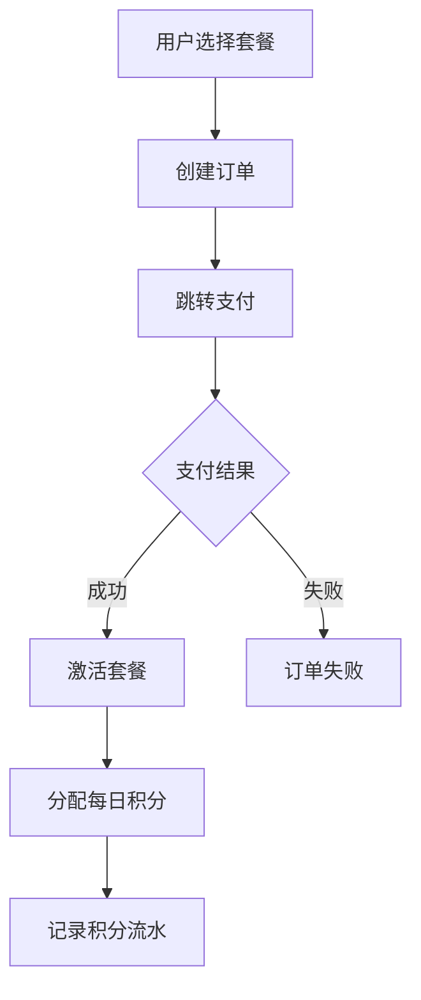
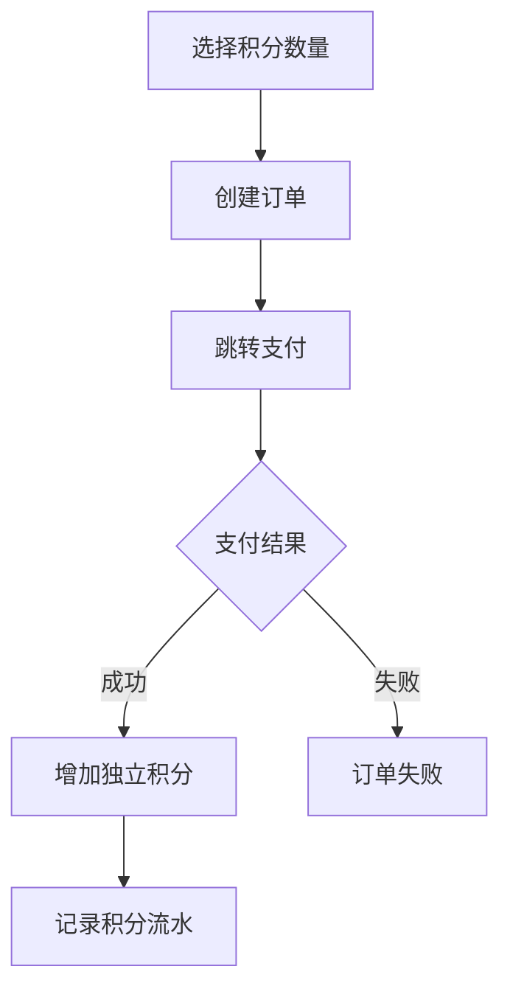

# AI积分订单系统设计文档

## 1. 系统概述

### 1.1 背景
KOI AI平台需要一个完整的订单系统来管理用户的AI服务积分购买。系统支持两种购买模式：
- **套餐购买**：用户购买月度/季度/年度套餐，获得每日重置的积分
- **积分购买**：用户直接购买独立积分，不会重置

### 1.2 核心功能
- 套餐管理和购买
- 独立积分购买
- 积分余额管理
- 积分使用追踪
- 订单历史记录
- 自动积分重置

### 1.3 技术栈
- **前端**：Next.js 14 + TypeScript + TailwindCSS
- **后端**：Next.js API Routes
- **数据库**：MySQL + Prisma ORM
- **支付**：Stripe / 支付宝 / 微信支付
- **定时任务**：Node-cron

## 2. 业务流程

### 2.1 套餐购买流程


### 2.2 积分购买流程


### 2.3 积分使用策略
1. **优先级**：优先使用套餐积分，不足时使用独立积分
2. **扣减规则**：
   - 套餐积分：当日有效，次日重置
   - 独立积分：永久有效，用完为止
3. **并发控制**：使用数据库事务保证积分扣减的原子性

### 2.4 每日重置机制
- **执行时间**：每日凌晨 00:00
- **重置范围**：所有活跃套餐的用户
- **重置逻辑**：
  1. 查询所有活跃套餐
  2. 重置套餐积分为套餐配置的每日积分数
  3. 记录重置流水
  4. 更新重置时间戳

## 3. 数据模型设计

### 3.1 核心实体关系
```
User (用户)
  ├── Order (订单) [1:N]
  ├── UserPackage (用户套餐) [1:N]
  ├── CreditBalance (积分余额) [1:1]
  └── CreditTransaction (积分流水) [1:N]

Package (套餐)
  ├── Order (订单) [1:N]
  └── UserPackage (用户套餐) [1:N]
```

### 3.2 数据一致性保证
- **事务处理**：所有积分操作使用数据库事务
- **乐观锁**：使用版本号防止并发更新冲突
- **余额快照**：每笔流水记录操作后的余额
- **数据审计**：完整的操作日志和流水记录

## 4. API设计

### 4.1 套餐管理
| 接口 | 方法 | 描述 |
|------|------|------|
| `/api/packages` | GET | 获取套餐列表 |
| `/api/packages/:id` | GET | 获取套餐详情 |
| `/api/packages/active` | GET | 获取用户当前套餐 |

### 4.2 订单管理
| 接口 | 方法 | 描述 |
|------|------|------|
| `/api/orders/create` | POST | 创建订单 |
| `/api/orders/list` | GET | 订单列表 |
| `/api/orders/:id` | GET | 订单详情 |
| `/api/orders/pay/callback` | POST | 支付回调 |

### 4.3 积分管理
| 接口 | 方法 | 描述 |
|------|------|------|
| `/api/credits/balance` | GET | 获取积分余额 |
| `/api/credits/transactions` | GET | 积分流水 |
| `/api/credits/use` | POST | 使用积分 |

## 5. 安全设计

### 5.1 支付安全
- HTTPS加密传输
- 支付签名验证
- 防重放攻击
- 支付回调IP白名单

### 5.2 数据安全
- 敏感信息加密存储
- SQL注入防护
- XSS防护
- CSRF防护

### 5.3 业务安全
- 积分操作幂等性
- 防止超卖
- 异常订单监控
- 风控规则

## 6. 性能优化

### 6.1 数据库优化
- 合理的索引设计
- 读写分离（未来）
- 查询优化
- 定期数据归档

### 6.2 缓存策略
- 套餐信息缓存
- 用户积分余额缓存
- 热点数据缓存

### 6.3 异步处理
- 支付回调异步处理
- 积分重置异步执行
- 消息队列（未来）

## 7. 监控告警

### 7.1 业务监控
- 订单成功率
- 支付成功率
- 积分使用情况
- 套餐激活情况

### 7.2 技术监控
- API响应时间
- 数据库性能
- 错误率
- 系统资源

### 7.3 告警规则
- 支付失败率异常
- 积分余额异常
- 重置任务失败
- 系统错误

## 8. 扩展性设计

### 8.1 支持的扩展
- 多种支付方式
- 多币种支持
- 优惠券系统
- 推荐奖励
- 积分转赠
- 企业套餐

### 8.2 预留接口
- Webhook通知
- 第三方集成
- 数据导出
- 批量操作

## 9. 部署架构

### 9.1 部署环境
- **开发环境**：本地开发
- **测试环境**：测试服务器
- **生产环境**：云服务器集群

### 9.2 部署流程
1. 代码审查
2. 自动化测试
3. 构建打包
4. 灰度发布
5. 全量发布

## 10. 项目计划

### 阶段一：基础功能（第1-2周）
- [x] 需求分析和设计
- [ ] 数据库设计和迁移
- [ ] 套餐管理功能
- [ ] 基础订单功能

### 阶段二：核心功能（第3-4周）
- [ ] 积分管理系统
- [ ] 支付集成
- [ ] 积分重置任务
- [ ] 前端界面

### 阶段三：优化完善（第5-6周）
- [ ] 性能优化
- [ ] 监控告警
- [ ] 文档完善
- [ ] 上线部署

## 11. 风险控制

### 11.1 技术风险
- 数据库事务死锁
- 支付接口不稳定
- 并发控制问题

### 11.2 业务风险
- 积分超发
- 订单重复
- 套餐过期处理

### 11.3 应对措施
- 完善的测试用例
- 灰度发布
- 回滚机制
- 数据备份

## 12. 总结

本系统设计充分考虑了业务需求、技术实现、安全性、性能和扩展性。通过模块化设计和清晰的接口定义，确保系统的可维护性和可扩展性。系统将分阶段实施，确保每个阶段的质量和稳定性。