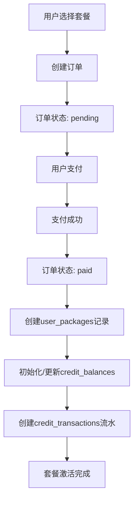
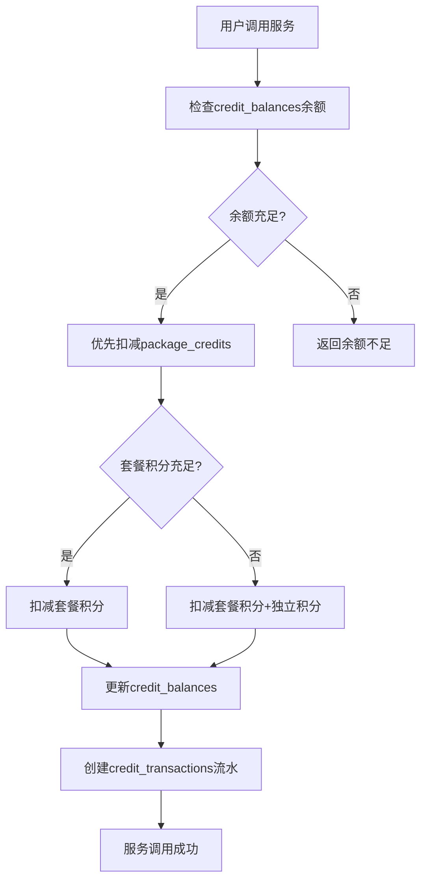
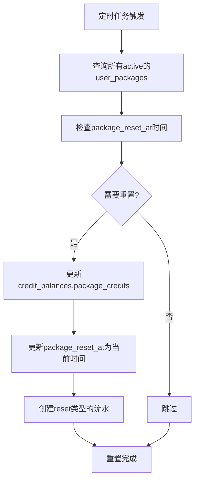
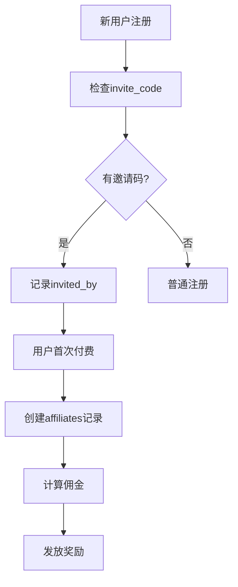

# 数据库设计文档

## 一、数据库架构概览

本系统采用 MySQL 数据库，使用 Prisma ORM 进行数据管理。整体架构围绕用户系统、套餐管理、积分系统、订单系统、内容管理等核心业务模块设计。

## 二、数据表详细说明

### 1. 用户管理模块

#### 1.1 users（用户表）
**作用**：存储系统所有用户的基本信息和认证信息。

| 字段名 | 类型 | 说明 |
|--------|------|------|
| id | INT | 主键，自增 |
| uuid | VARCHAR(255) | 用户唯一标识符 |
| email | VARCHAR(255) | 用户邮箱 |
| nickname | VARCHAR(255) | 用户昵称 |
| avatar_url | VARCHAR(255) | 头像URL |
| locale | VARCHAR(50) | 语言偏好 |
| signin_type | VARCHAR(50) | 登录类型 |
| signin_ip | VARCHAR(255) | 登录IP |
| signin_provider | VARCHAR(50) | 第三方登录提供商 |
| signin_openid | VARCHAR(255) | 第三方平台OpenID |
| invite_code | VARCHAR(255) | 邀请码 |
| invited_by | VARCHAR(255) | 邀请人UUID |
| is_affiliate | BOOLEAN | 是否为推广员 |
| password | VARCHAR(255) | 密码（加密存储） |
| created_at | DATETIME | 创建时间 |
| updated_at | DATETIME | 更新时间 |

**索引**：
- 唯一索引：uuid, email+signin_provider
- 普通索引：email, invite_code

---

#### 1.2 email_verification_codes（邮箱验证码表）
**作用**：管理用户注册和密码重置时的邮箱验证码。

| 字段名 | 类型 | 说明 |
|--------|------|------|
| id | INT | 主键 |
| email | VARCHAR(255) | 邮箱地址 |
| code | VARCHAR(6) | 6位验证码 |
| expires_at | DATETIME | 过期时间 |
| created_at | DATETIME | 创建时间 |
| is_used | BOOLEAN | 是否已使用 |

---

#### 1.3 apikeys（API密钥表）
**作用**：存储用户的API访问密钥，用于API调用认证。

| 字段名 | 类型 | 说明 |
|--------|------|------|
| id | INT | 主键 |
| api_key | VARCHAR(255) | API密钥（唯一） |
| title | VARCHAR(100) | 密钥名称 |
| user_uuid | VARCHAR(255) | 所属用户UUID |
| status | VARCHAR(50) | 状态（active/inactive） |
| created_at | DATETIME | 创建时间 |

**关系**：
- 与 users 表通过 user_uuid 关联（多对一）

---

### 2. 套餐管理模块

#### 2.1 packages（套餐表）
**作用**：定义系统中可购买的套餐产品，包括价格、积分额度等。

| 字段名 | 类型 | 说明 |
|--------|------|------|
| id | CHAR(36) | UUID主键 |
| name | VARCHAR(100) | 套餐名称 |
| name_en | VARCHAR(100) | 英文名称 |
| version | VARCHAR(20) | 版本号 |
| description | TEXT | 套餐描述 |
| price | INT | 价格（分） |
| original_price | INT | 原价 |
| currency | VARCHAR(10) | 货币类型 |
| daily_credits | INT | 每日积分额度 |
| valid_days | INT | 有效天数 |
| features | JSON | 功能特性列表 |
| limitations | JSON | 限制条件 |
| sort_order | INT | 排序权重 |
| is_active | BOOLEAN | 是否上架 |
| is_recommended | BOOLEAN | 是否推荐 |
| tag | VARCHAR(50) | 标签 |
| created_at | DATETIME | 创建时间 |
| updated_at | DATETIME | 更新时间 |

---

#### 2.2 user_packages（用户套餐表）
**作用**：记录用户购买的套餐实例，管理套餐的有效期和状态。

| 字段名 | 类型 | 说明 |
|--------|------|------|
| id | CHAR(36) | UUID主键 |
| user_uuid | VARCHAR(255) | 用户UUID |
| package_id | CHAR(36) | 套餐ID |
| order_no | VARCHAR(255) | 订单号 |
| start_date | DATETIME | 生效日期 |
| end_date | DATETIME | 到期日期 |
| daily_credits | INT | 每日积分额度 |
| package_snapshot | JSON | 购买时的套餐快照 |
| is_active | BOOLEAN | 是否激活 |
| is_auto_renew | BOOLEAN | 是否自动续费 |
| created_at | DATETIME | 创建时间 |
| updated_at | DATETIME | 更新时间 |

**关系**：
- 与 users 表通过 user_uuid 关联（多对一）
- 与 packages 表通过 package_id 关联（多对一）
- 与 orders 表通过 order_no 关联（一对一）

---

### 3. 积分系统模块

#### 3.1 credit_balances（积分余额表）
**作用**：存储用户的实时积分余额，包括套餐积分和独立积分。

| 字段名 | 类型 | 说明 |
|--------|------|------|
| id | CHAR(36) | UUID主键 |
| user_uuid | VARCHAR(255) | 用户UUID（唯一） |
| package_credits | INT | 套餐积分（每日重置） |
| package_reset_at | DATETIME | 上次重置时间 |
| independent_credits | INT | 独立积分（永久有效） |
| total_used | INT | 累计使用积分 |
| total_purchased | INT | 累计购买积分 |
| version | INT | 乐观锁版本号 |
| created_at | DATETIME | 创建时间 |
| updated_at | DATETIME | 更新时间 |

**关系**：
- 与 users 表通过 user_uuid 关联（一对一）

**特点**：
- 使用乐观锁（version字段）防止并发更新冲突
- 套餐积分每日自动重置
- 独立积分永久有效

---

#### 3.2 credit_transactions（积分流水表）
**作用**：记录所有积分变动的详细流水，用于审计和查询。

| 字段名 | 类型 | 说明 |
|--------|------|------|
| id | CHAR(36) | UUID主键 |
| trans_no | VARCHAR(255) | 交易流水号（唯一） |
| user_uuid | VARCHAR(255) | 用户UUID |
| type | VARCHAR(20) | 交易类型（income/expense/reset） |
| credit_type | VARCHAR(20) | 积分类型（package/independent） |
| amount | INT | 变动数量 |
| before_balance | INT | 变动前余额 |
| after_balance | INT | 变动后余额 |
| order_no | VARCHAR(255) | 关联订单号 |
| description | VARCHAR(500) | 描述 |
| metadata | JSON | 额外元数据 |
| created_at | DATETIME | 创建时间 |

**关系**：
- 与 users 表通过 user_uuid 关联（多对一）
- 与 orders 表通过 order_no 关联（多对一）

---

#### 3.3 credits（旧积分交易表）
**作用**：历史遗留表，建议迁移到 credit_transactions。

| 字段名 | 类型 | 说明 |
|--------|------|------|
| id | INT | 主键 |
| trans_no | VARCHAR(255) | 交易号 |
| user_uuid | VARCHAR(255) | 用户UUID |
| trans_type | VARCHAR(50) | 交易类型 |
| credits | INT | 积分数量 |
| order_no | VARCHAR(255) | 订单号 |
| expired_at | DATETIME | 过期时间 |
| created_at | DATETIME | 创建时间 |

---

### 4. 订单系统模块

#### 4.1 orders（订单表）
**作用**：管理所有订单，包括套餐订单和积分充值订单。

| 字段名 | 类型 | 说明 |
|--------|------|------|
| id | INT | 主键 |
| order_no | VARCHAR(255) | 订单号（唯一） |
| user_uuid | VARCHAR(255) | 用户UUID |
| user_email | VARCHAR(255) | 用户邮箱 |
| amount | INT | 订单金额（分） |
| interval | VARCHAR(50) | 订阅周期 |
| expired_at | DATETIME | 订单过期时间 |
| status | VARCHAR(50) | 订单状态 |
| stripe_session_id | VARCHAR(255) | Stripe会话ID |
| credits | INT | 积分数量 |
| currency | VARCHAR(50) | 货币类型 |
| order_type | VARCHAR(20) | 订单类型（package/credits） |
| package_id | CHAR(36) | 套餐ID |
| package_snapshot | JSON | 套餐快照 |
| credit_amount | INT | 积分数量 |
| start_date | DATETIME | 套餐开始日期 |
| end_date | DATETIME | 套餐结束日期 |
| discount_amount | INT | 折扣金额 |
| coupon_code | VARCHAR(50) | 优惠券码 |
| payment_method | VARCHAR(50) | 支付方式 |
| paid_at | DATETIME | 支付时间 |
| paid_email | VARCHAR(255) | 支付邮箱 |
| paid_detail | TEXT | 支付详情 |
| refund_status | VARCHAR(50) | 退款状态 |
| refund_amount | INT | 退款金额 |
| refund_at | DATETIME | 退款时间 |
| created_at | DATETIME | 创建时间 |

**关系**：
- 与 users 表通过 user_uuid 关联（多对一）
- 与 packages 表通过 package_id 关联（多对一）
- 与 user_packages 表通过 order_no 关联（一对一）
- 与 credit_transactions 表通过 order_no 关联（一对多）

**订单状态流转**：
```
pending（待支付） -> processing（处理中） -> paid（已支付）
                  -> failed（失败）
                  -> cancelled（已取消）
paid -> refunded（已退款）
```

---

### 5. 推广联盟模块

#### 5.1 affiliates（推广记录表）
**作用**：管理推广联盟体系，记录推广关系和佣金。

| 字段名 | 类型 | 说明 |
|--------|------|------|
| id | INT | 主键 |
| user_uuid | VARCHAR(255) | 被推广用户UUID |
| invited_by | VARCHAR(255) | 推广人UUID |
| status | VARCHAR(50) | 状态 |
| paid_order_no | VARCHAR(255) | 首单订单号 |
| paid_amount | INT | 支付金额 |
| reward_percent | INT | 佣金比例 |
| reward_amount | INT | 佣金金额 |
| created_at | DATETIME | 创建时间 |

**关系**：
- 与 users 表通过 user_uuid 和 invited_by 关联

---

### 6. 内容管理模块

#### 6.1 posts（文章表）
**作用**：管理博客文章和内容发布。

| 字段名 | 类型 | 说明 |
|--------|------|------|
| id | INT | 主键 |
| uuid | VARCHAR(255) | 文章UUID |
| slug | VARCHAR(255) | URL友好标识 |
| title | VARCHAR(255) | 标题 |
| description | TEXT | 描述 |
| content | TEXT | 内容 |
| status | VARCHAR(50) | 状态（draft/published） |
| cover_url | VARCHAR(255) | 封面图URL |
| author_name | VARCHAR(255) | 作者名称 |
| author_avatar_url | VARCHAR(255) | 作者头像 |
| locale | VARCHAR(50) | 语言 |
| created_at | DATETIME | 创建时间 |
| updated_at | DATETIME | 更新时间 |

---

#### 6.2 categories（分类表）
**作用**：管理图片和内容的分类。

| 字段名 | 类型 | 说明 |
|--------|------|------|
| id | CHAR(36) | UUID主键 |
| user_id | VARCHAR(255) | 用户ID |
| name | VARCHAR(100) | 分类名称 |
| color | VARCHAR(20) | 颜色标记 |
| sort_order | INT | 排序 |
| created_at | DATETIME | 创建时间 |
| updated_at | DATETIME | 更新时间 |

**关系**：
- 与 images 表一对多关系

---

#### 6.3 images（图片表）
**作用**：存储用户上传的图片资源。

| 字段名 | 类型 | 说明 |
|--------|------|------|
| id | CHAR(36) | UUID主键 |
| user_id | VARCHAR(255) | 用户ID |
| file_url | TEXT | 文件URL |
| thumbnail_url | TEXT | 缩略图URL |
| name | VARCHAR(255) | 文件名 |
| category_id | CHAR(36) | 分类ID |
| file_size | INT | 文件大小 |
| mime_type | VARCHAR(100) | MIME类型 |
| width | INT | 宽度 |
| height | INT | 高度 |
| created_at | DATETIME | 创建时间 |
| updated_at | DATETIME | 更新时间 |

**关系**：
- 与 categories 表通过 category_id 关联（多对一）

---

#### 6.4 feedbacks（反馈表）
**作用**：收集用户反馈和评价。

| 字段名 | 类型 | 说明 |
|--------|------|------|
| id | INT | 主键 |
| user_uuid | VARCHAR(255) | 用户UUID |
| content | TEXT | 反馈内容 |
| rating | INT | 评分 |
| status | VARCHAR(50) | 状态 |
| created_at | DATETIME | 创建时间 |

---

## 三、核心业务流程

### 1. 套餐购买流程



**涉及的表**：
1. orders - 创建订单记录
2. user_packages - 创建用户套餐实例
3. credit_balances - 初始化或更新积分余额
4. credit_transactions - 记录积分变动流水

### 2. 积分使用流程



**积分使用优先级**：
1. 优先使用套餐积分（每日重置）
2. 套餐积分不足时使用独立积分
3. 所有变动记录在流水表中

### 3. 每日积分重置流程



### 4. 推广联盟流程



## 四、数据安全与优化

### 1. 安全措施
- 密码使用加密存储
- API密钥独立管理
- 支付信息脱敏处理
- 使用乐观锁防止并发冲突

### 2. 性能优化
- 关键字段建立索引
- 使用UUID避免主键冲突
- JSON字段存储灵活数据
- 分表存储历史流水

### 3. 数据一致性
- 使用事务保证原子性
- 积分变动前后余额记录
- 订单状态机严格控制
- 套餐快照保存历史信息

## 五、扩展性设计

### 1. 多语言支持
- posts表支持locale字段
- packages表支持name_en字段

### 2. 多支付渠道
- orders表支持payment_method字段
- 支持Stripe等第三方支付

### 3. 灵活的积分体系
- 套餐积分与独立积分分离
- 支持不同类型的积分来源
- 完整的流水审计

## 六、维护建议

1. **定期清理**：
   - 过期的验证码记录
   - 已取消的订单
   - 历史流水归档

2. **监控要点**：
   - 积分余额异常
   - 订单支付成功率
   - 套餐到期提醒

3. **备份策略**：
   - 每日全量备份
   - 实时增量备份
   - 异地容灾备份